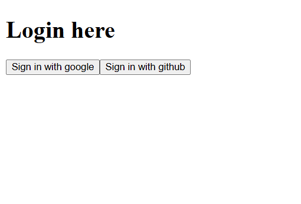
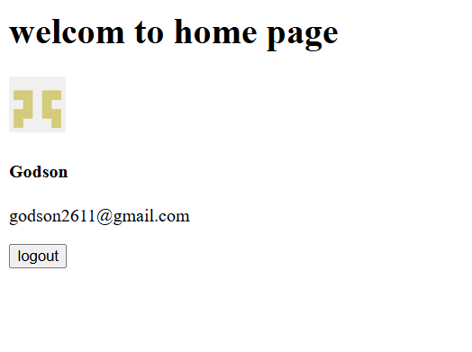

# NextAuth Integration for Konnectify

This project demonstrates the implementation of **NextAuth.js** for authentication in a Next.js application.

## Screenshot




## Setup Steps

1. Clone the repository:

   ```bash
   git clone https://github.com/Godson2611/next-auth.git
   npm run dev
   ```

2. start the project:

   ```bash
   npm run dev
   ```
